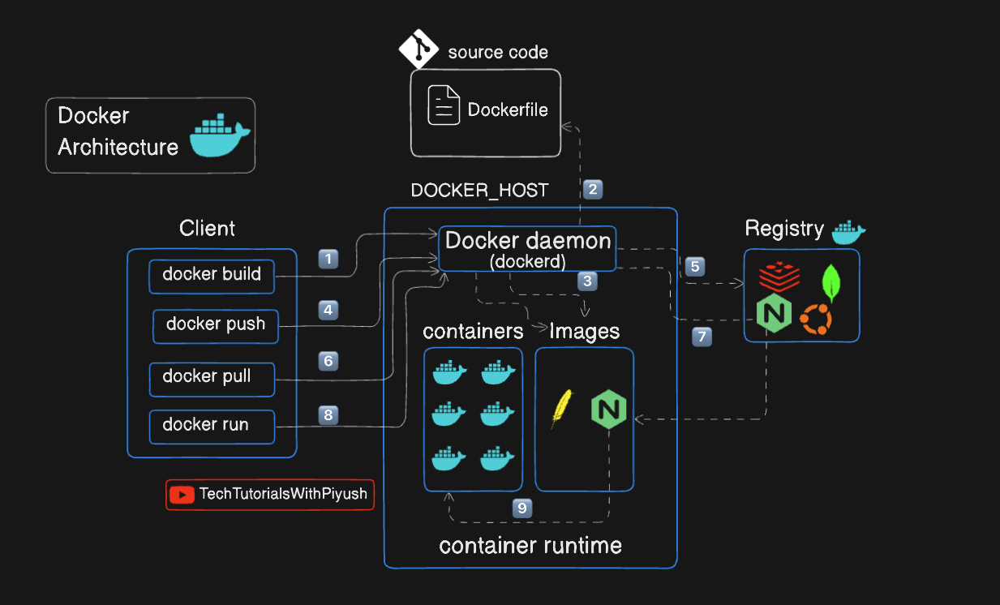
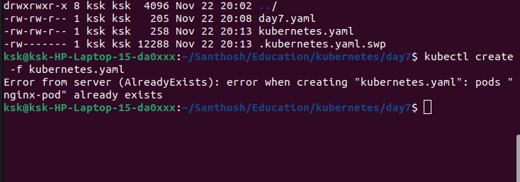
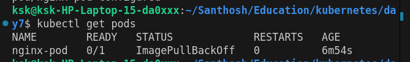
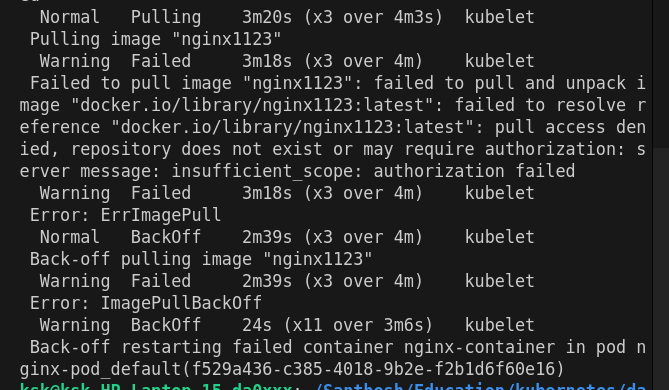
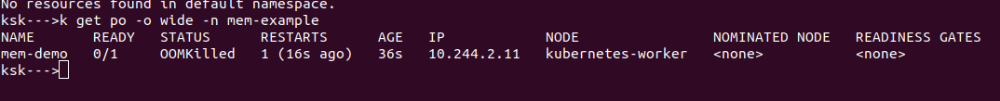
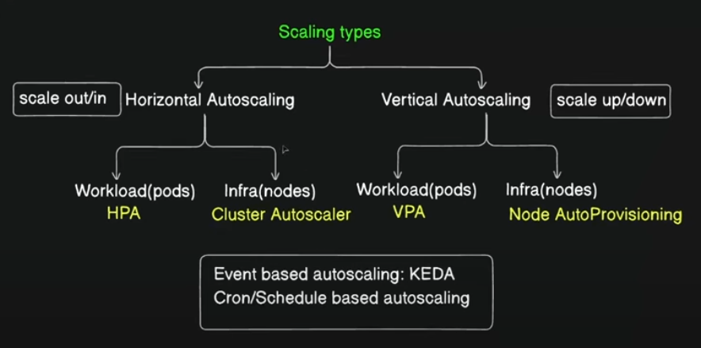
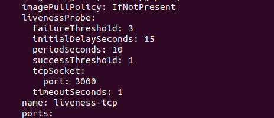

https://github.com/piyushsachdeva/CKA-2024
### Day 1



Node = Virtual machine

##### POD 

encapsulates the containers
one or more containers withing POD is possible

##### Master Node

API Server is the center of control plane (master node) - which recieves all the communication

Scheduler receives request from API server for Scheduling pods

"Controler managener" - is to make sure everything working fine and monitors the pods
Node Controler
namespace
deployment 
etc 

ETCD = is a Key value data stores
Stores everything - cluster info

Data is updated and retrieved by API server

##### Worker Node

Kubelet = get instruction from API server(control plane - master node) and enables communication between master and worker node
every worker node has kubelet

Kube-proxy

Enables networking within the nodes for enabling communication
has networking tables


##### kubectl

request -> authenticate -> validate -> api server

##### Kubernetes Architecture


##### Master/Control plane Node V/s Worker Node ( Node is nothing but a Virtual machine)


##### ApiServer :- Client interacts with the cluster using ApiServer


##### Scheduler: decide which pod to be scheduled on which node based on different factors


##### Controller Manager


##### ETCD Server - Key value database that stores the cluster state and configuration


##### Kubelet - Node-level agent that helps container management and receives instructions from Api server


##### Kube proxy - Pod to pod communication


#### Installation of Kind

https://kind.sigs.k8s.io/


#### Kind


kind create cluster --name kubernets

kubectl cluster-info --context kubernets

kubectl get nodes

##### Multi node cluster

cluster-config.yaml
~~~
kind: Cluster
apiVersion: kind.x-k8s.io/v1alpha4
nodes:
- role: control-plane
- role: worker
- role: worker
~~~
kind create cluster --name kubernets2 --config cluster-config.yaml

https://kubernetes.io/docs/reference/kubectl/quick-reference/

kind delete cluster --name kubernets
kubectl get nodes --context kind-kubernets2

kubectl config get-contexts


kubectl config set-contect kind-kubernets2

kubectl config use-contect kind-kubernets2


### day 7

Ways to create a pod

1. Imperative - kubectl commands
2. Declarative - config file - json / yaml - desired state of the object
    - kubectl apply / create

------

#### Create a nginx pod
 
Note : run the below command when a cluster is running
```
kubectl run nginx-pod --image=nginx:latest


kubectl explain pod


kubectl create -f kubernetes.yaml
```


Deleting the runing pod
```
kubectl delete pod nginx-pod
```

kubectl apply command is used to update the existing pods details but it can also be used to create a new pod
```
kubectl apply -f kubernetes.yaml

```

Making error in config file
```
kubectl apply -f error.yaml
```


ImagePullBackOff : there was an issue when pulling the image (cause in the file we messed it haha!)

Getting more detials
```
kubectl describe pod nginx-pod 
```



Now how to fix it within the kubectl

```
kubectl edit pod nginx-pod

pod/nginx-pod edited

```

How to get inside the pod

```
kubectl exec -it nginx-pod -- sh
```

Creating a yaml file is time consuming, so how to make it easy

```
# Dry running 

kubectl run nginx --image=nginx --dry-run=client

# Outputing in yaml format u can change it to Json too

kubectl run nginx --image=nginx --dry-run=client -o yaml
kubectl run nginx --image=nginx --dry-run=client -o yaml > dry-run.yaml

```

Getting pod details
```
kubectl describe pod nginx-pod

Getting pod labels

kubectl get pods nginx-pod --show-label

How to get all the infromation about all the pods
    - this will give IP, NODE etc

kubectl get pods -o wide

this can also be used with get nodes command

kubectl get nodes -o wide

```

### Day 8

Replication controller 
- Application does not crash
- manages replica of a pod

The replication controller file basically have the details of the pods and no of replicas to be maintained
```
# Make sure no pods are running

kubectl apply -f ./replicationController.yaml

```

Difference between replication controller and replica set is
replication controller is a legacy version
Replication controller can only manage the pods which are created as part of it, existing pods can not be included

But with replica set we can manage the existing pods which are not part of it

Field for this use is 

```
selector:
  matchLabels:
    env: demo
```

So we have create a replica set config it throws the below error, saying the version is wrong


But why


here this says the version is V1 which we had in the file.
So thats not the right version cause its part of the group "apps"

SO the version should be "apps/v1"

```
# delete the existing replica controller

kubectl delete rc nginx-rc

#or

kubectl delete rc/nginx-rc

```


Now how to change the replication number in replica set

1. Change the config file and apply
2. Edit the live replica set 
```
kubectl edit rs nginx-rs
```
3. Use the kubectl imperative way- using command line 
```
kubectl scale --replicas=3 rs nginx-rs
```

#### Deployment

for example you are running your v1 pods with replica set and you want to update the pods to v2

now the replica set will delete the all the pods and create new pods with newer version

this will disrupt the active user

So this were deployment comes in

"Deployment" wont remove all the pods at same time
it will start from a single pod
updating one pod and the network traffic will be redirected to other pods 
once the upgrade is completed it will move to next pod and the upgraded pod will be added to replica set 
it will start to recieve traffic

- undo the deployment
- roll out to particular version

#### Delete the existing replica set

```
kubectl delete rs nginx-rs
```

#### create deployment configs (manifest)

```
kubectl get deployments

#OR

kubectl get deploy

```

#### Get all the things created
```
kubectl get all
```


#### How to change the image of the pod in the deployment

```
kubectl set image deploy/nginx-deployment \
nginx=nginx:1.9.1

#here the "nginx" means the container name defined the deployment config

kubectl describe deploy/nginx-deployment

kubectl edit deploy/nginx-deployment
```

#### Now we made changes, to view the history 

```
kubectl rollout history deploy/nginx-deployment
```


#### Can we undo the changes

```
kubectl rollout undo deploy/nginx-deployment
```

### Day 9

#### Services

Cluster IP
nodeport
external names
load balancer


##### Node port
The application will be exposed on specific port to the external users
Range : 30000 to 32767

Each service will access the node port and it will have its own internal cluster port 

Target port
This were the application pod is lisenting on internally
this not exposed


Delete a node port service

```
kubectl delete service/nodeport-svc
```

##### Cluster IP

When a pod is deleted and new one created the IP address will be changed

So to interact with a service (backend cluster) we need a IP address which wont change so other internal service (DB cluster / front end) can access the service 


```
alias 'k=kubectl'
# to get the endpoints of the services
k get ep
```

##### Load balancer

Load balancer service needs an external load balancer 

##### External Name

It basically for giving an internal dns name for a service

### Day 10

#### Namespaces

If no namespace is mentioned all the things will be created in "default" namespace

The control plane things will be created in "kube-system" namespace

the pods in a same namespace can communicate easily by using the hostname,but if the pods are in diferent namespaces then they need to use FQDN - Fully Qualified Domain Name


To get all the namespaces
```
kubectl get ns

#or

k get namespaces
```

now to get the things inside a namespace
```
k get all --namespace=default

#or

k get all -n default

# -n stands for namespace

#to create namespace
kubeclt create ns demo
#to delete a namespace
kubectl delete ns/demo

```
##### Creating a deployment in imperative way in cli

```
# dry - run command
kubectl create deploy nginx-deploy --image=nginx -r 1 -n demo --dry-run=client -o yaml

k create deploy nginx-deploy --image=nginx -r 1 -n demo

```

The pods in the namespace can communicate with each other 

let scale it

```
k scale --replicas 2 deploy/nginx-deploy -n demo
k scale --replicas 2 deploy/nginx-test
```

now that we hace scaled it,
lets expose this service

```
k expose --name svc-demo deploy/nginx-deploy --port=80 -n demo

k expose --name svc-default deploy/nginx-test --port=80 

```

now if you try to curl the service name in the pods it wont work

but the ip address of the services will still be accessble

for example inside the pods of each namespace

this will work
curl 10.244.2.1 -- ip address of the service in the another namespace

but this wont work
curl svc-demo

```
cat /etc/resolv.conf
```


so to reach the service, we have to give the FQDN
```
[service-name].[namespace].svc.cluster.local
```

so this means

```
curl svc-demo.demo.svc.cluster.local
```
this will work in the default namespace pod to call the service in demo namespace


### Day 11

#### Multi container pods

##### Init container

"Command" is to specify what you are going to run and you pass the actual command as an argument in "args", like below
```yaml
command: ['sh','-c']
args: ['ls ;echo hi']

```
";" semi colon is to split the commands

you can also specify the argument inside the command itself

```yaml
command: ['sh','-c','echo hi']
```


So now the pod is waiting for the init container to complete

to see the logs 
```
k logs pods/app-pod
```


how to get the init container log 

```
# here in the below command '-c' stands for container from which the logs should be showed cause a pod can have multiple container, 'init-my-service' is the name of the initcontainer
k logs pods/app-pod -c init-my-service
```
now we need to create a deployment and service to expose the deployment so the init container can complete the task
```
k create deploy nginx-deploy --image=nginx --port=80
k expose deploy nginx-deploy --name myservice --port 80
```

now the service is exposed, the init container will do its job and the main container wil start

```
k exec -it app-pod -- printenv
# or
k exec -it app-pod -- 'env'
# or you can open up a shell and run the command
```

1. You can't add or remove initcontainers in a pod once it is created
2. For the pod to start running all the init container should be completed first

Since we added a 2nd init container the pod requires two service to be up running

```
k create deploy db-deploy --image=redis --port=80
k expose deploy db-deploy --name mydb --port 80

```

so to continually watch a change use '-w' 
```
k get pods -w
```
##### Sidecar / helper container

### Day 12

#### Daemon sets

So Daemon sets are kind of similar to replica sets but it is used for specific tasks, such as
1. Running monitoring agents 
2. Networking things : kube proxy, weave-net(CNI plugin)
3. logging agent

Daemon sets create a replica of the service in each node when a new node is added to the cluster and when a node is deleted the daemon sets replica will also be deleted

Daemon set create replicas in each node available in the cluster

#### Cron jobs
https://kubernetes.io/docs/concepts/workloads/controllers/cron-jobs/

#### Jobs

https://kubernetes.io/docs/concepts/workloads/controllers/job/


### Day 13

#### Static pods

etcd
api server
scheduler
control manager

these are the static pods and these are run by the kubelet in the control plane node only 

manifest of these can be found on 
/etc/kubernetes/manifests/

kubelet in the master node (control plane nod) monitors this

#### Manual Scheduling

scheduler is responsible for new pods creation / allocation

Schedular only cares about the pods which doesnot have the selector "nodeName"

Once a pod is scheduled and running in a node, we can't move to an another node
we have to delete the pod and create a new pod

Even if the schedular is not there, but the nodename is specified in the manifest, then the pod will be scheduled in that particular node


#### Selector

k get pods --selector tier=frontend

use the labels mentioned in the pod level to filter 

### Day 14

#### Taint is on Node
#### Toleration is on POD

Taint is a condition set a node and if pod meets the condition by having the toleration then the pod will be scheduled on the node

it is a key and value pair

Along with toleration in a pod config, there is something called as "effect"

There 3 different effect

1. noSchedule
2. preferNoschedule
3. noExecute

##### noSchedule
Means the taint and toleration will effect on the newer pods 

##### noExecute
means this will apply to existing and new pods
if an existing pod does not tolerate the taint the pod will be evicted

##### preferNoschedule
it tries to apply the taint (tolerate) but there is no garuntee

#### Taint command 
```
# k taint node [nodename] key=value:[effect]

k taint node kubernetes-worker gpu=true:NoSchedule
```

So if all nodes in the cluster has a taint and if you try to create a pod without toleration you will see the below message in log


you cant add toleration to a pod in cli

To remove the taint use the create command with "-" at the end

```
k taint node kubernetes-worker gpu=true:NoSchedule-
```
Adding Taint to a node and toleration to a pod does not always garuntee that the pod will always run on the tolerated node
see the bellow image, the pods has toleration to run the kubernetes-worker node but it is running on the kubernetes-worker2 node
the kubernetes-worker2 node doesn't have the taint


#### This were selector and labels come 

Add "nodeSelector" property under "Spec" of the pod config

if no node in the cluster have this label then the pod wont be schedules, you will get the be message


So lets add a label to the node

```
k label node kubernetes-worker gpu=false
```

Even if a node has the label, the pod wont be scheduled if the node has a taint that is not tolerated by the pod

to remove a label from a node 

k label node [nodename] [labelname]-
```
k label node kubernetes-worker gpu-
```

### Day 15

#### Node afinity

Affinity if kind of selector and label mentioned above but the difference is, in the above you can only have match condition but in affinity you can have
1. =
2. in
3. != (not equal to)

Lets say when a pod was scheduled with an affinity, during the scheduling the node had the label.
After that the label was removed,
now what will happen

to determine that we have two configs

1. requiredDuringSchedulingIgnoredDuringExecution - node is important for the pod
2. preferredDuringSchedulingIngnoredDuringExecution - scheduling is important for the pod

in both this cases after the pod is executed, affinity doesnt play a role here
only when a pod is scheduled the affinity is matters

for preferredDuringSchedulingIgnoredDuringExecution even if the conditions not met the pod will be scheduled


### Day 16

insufficient resources
OOM - out of memory
OOM killer 

Server metrics is an add-on 

https://kubernetes.io/docs/tasks/debug/debug-cluster/resource-metrics-pipeline/




### Day 17

#### Autoscaling

Increasing the service based on the workload

##### Horizontal Pod Autoscaling 

Adding same pod 
HPA is the only default thing present in kubernetes

HPA by default monitors the object for 15seconds
```

kubectl autoscale deployment [deploymentname] --cpu-percent=50 --min=1 --max=10

# to delete 

kubectl delete hpa [hpaName]

# to create the load

kubectl run -i --tty load-generator --rm --image=busybox:1.28 --restart=Never -- /bin/sh -c "while sleep 0.01; do wget -q -O- http://php-apache; done"


```
##### Vertical Pod Autoscaling

Increasing the size of the pod - memory and cpu
It requires down time for restarting the pod




We can have multiple kubernetes objects in a single yaml file
to separate the objects details add

'---'

at the end of each object

### Day 19

#### Health Probes

Health probes continuously monitors your application health

##### liveness probe

Restarts the application if fails

##### readiness probe

ensure the pod is ready for serving the network traffic

##### startup probe

for slow/ legacy apps- app that take long time to start

using readiness and liveness probes are suggested in production


These probes can do health check with the help of
* HTTP
* TCP
* command

"initialDelaySeconds" time the probes should wait before checking the container status

"periodSeconds" time interval between each check

"failureThreshold" how many times continuis failure can happen before restart

"successThreshold" how many successfull execution needed 



default toleration added for liveness


